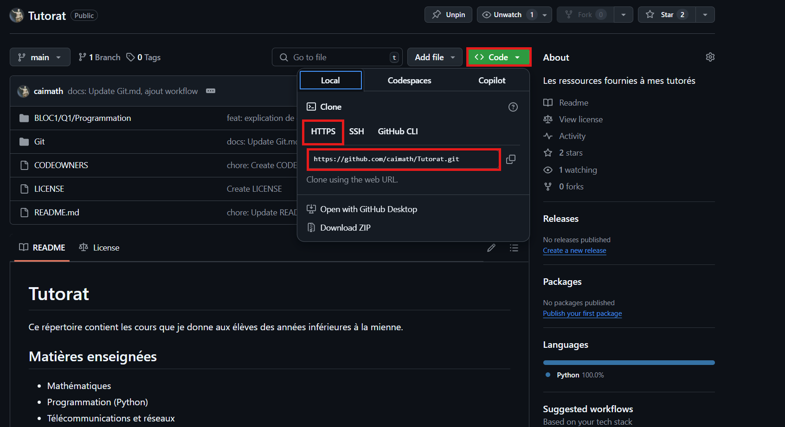

# Utiliser GitHub CLI

## Tutoriel

* Créer repo GitHub
* Cliquer sur code
* Copier l'URL
* git clone https://github.com/votre-utilisateur/votre-depot.git
* Puis réaliser les commandes habituelles (git add . , git commit -m "[message] et git push origin [branche])



Si la branche distante n'est pas trouvée:

``` bash
git remote add origin URL_du_depot(en.git)
```

Si on ne peut pas push parce qu'il y a une erreur, c'est peut-être que des modifications réalisées sur la branche distante ne sont pas dans ton repo local
```bash
git pull origin [branche]
```
