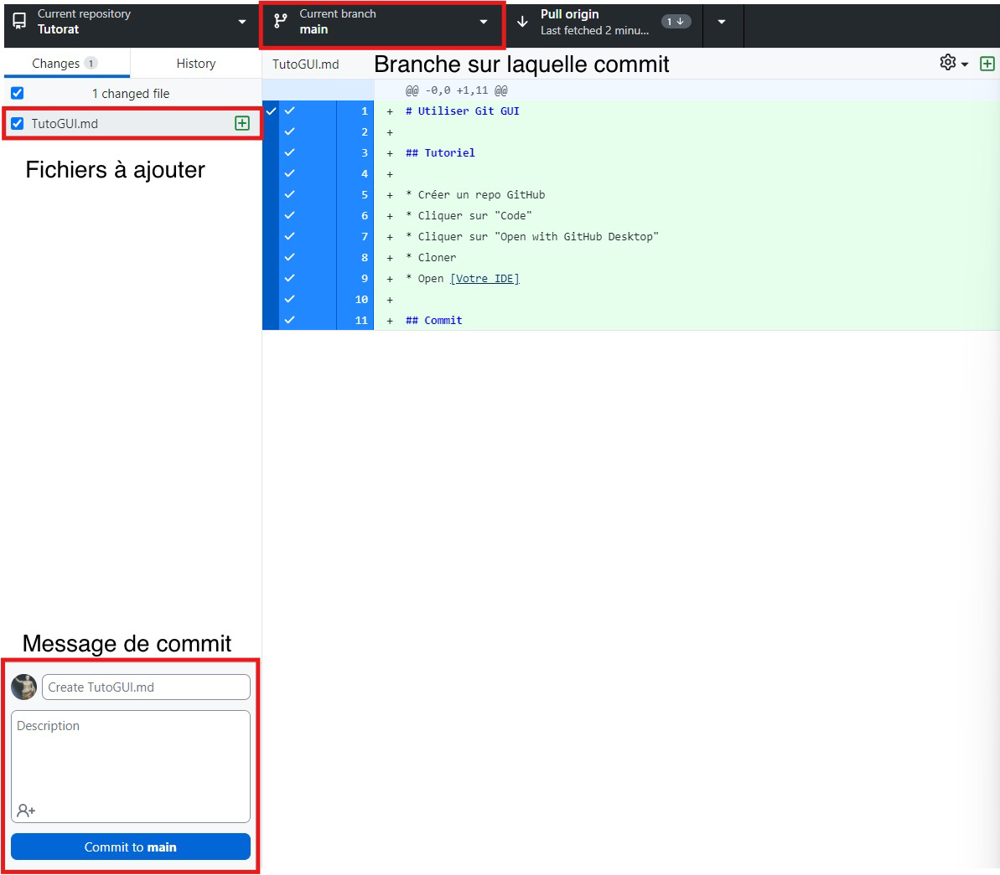

# Utiliser GitHub Desktop

## Tutoriel

* Créer un repo GitHub
* Cliquer sur "Code"
* Cliquer sur "Open with GitHub Desktop"
* Cloner
* Open [Votre IDE]

## Commit & Push

* Séléctionner les fichiers à commit et la branche utilisée
* Mettre un message de commit et une description
* Cliquer sur commit to main

  
